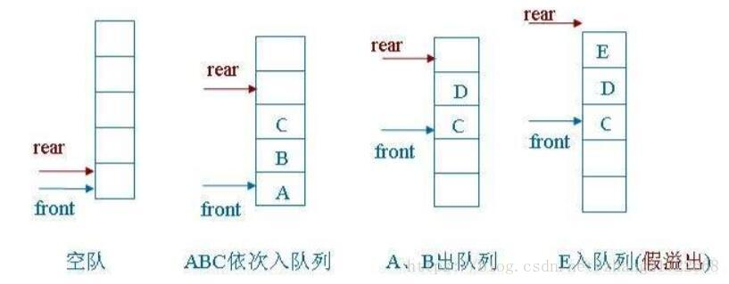
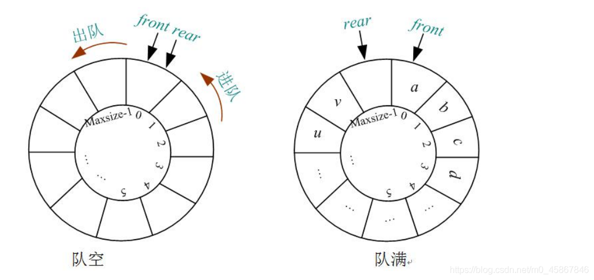

队列是一个有序列表 可以用数组或者链表来实现
遵循先进先出 如果是数组则为顺序存储 链表就是链式存储

假溢出：指队列进行多次入队与出队操作之后，队尾指针已经指向数组最后一个位置，但队列并没有被填满，如果再插入新的元素，就会超过数组的长度，这种溢出我们称为假溢出。

真溢出：指队列进行多次入队与出队操作之后，队尾指针已经指向数组最后一个位置，并且此时队列已经被填满，如果再插入新的元素，就会超过数组的长度，这种溢出我们称为真溢出。

这里用数组去实现队列 会有一些缺陷 数组本身只能使用一次 所以需要做一些变动

思路如下

1.front变量的含义做出调整:front指向队列的第一个元素 也就是说arr[front]就是队列第一个元素 初始值为0

2.rear变量含义做出调整:rear指向最后一个元素的位置，因为希望空出一个空间做约定，rear初始值为0

入队：队尾循环后移， rear =（rear+1）%Maxsize;

出队：队首循环后移， front =（front+1）%Maxsize;

队空：front=rear;  rear 和 front 指向同一个位置

队满:(rear+1) %Maxsize=front; // rear 向后移一位正好是 front

队列中有效数据个数: (rear+maxSize-front)%maxSize
